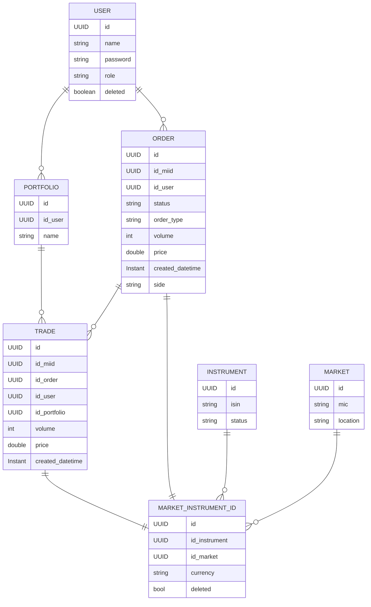

# Лаборраторная №1

Схема БД

```mermaid
erDiagram
    USER ||--o{ PORTFOLIO : ""
    USER ||--o{ ORDER : ""
    PORTFOLIO ||--o{ TRADE : ""
    ORDER ||--o{ TRADE : ""
    TRADE ||--|| MARKET_INSTRUMENT_ID : ""
    ORDER ||--|| MARKET_INSTRUMENT_ID : ""
    INSTRUMENT ||--o{ MARKET_INSTRUMENT_ID : ""
    MARKET ||--o{ MARKET_INSTRUMENT_ID : ""

    INSTRUMENT {
        UUID id
        string isin
        string status
    }    

    MARKET {
        UUID id
        string mic
        string location
    }
    MARKET_INSTRUMENT_ID {
        UUID id
        UUID id_instrument
        UUID id_market
        string currency
        bool deleted
    }

    TRADE {
        UUID id
        UUID id_miid
        UUID id_order
        UUID id_user
        UUID id_portfolio
        int volume
        double price
        Instant created_datetime
    }
    
    ORDER {
        UUID id
        UUID id_miid
        UUID id_user
        string status
        string order_type
        int volume
        double price
        Instant created_datetime
        string side
    }
    
    PORTFOLIO {
        UUID id
        UUID id_user
        string name
    }

    USER {
        UUID id
        string name
        string password
        string role
        boolean deleted
    }
```
